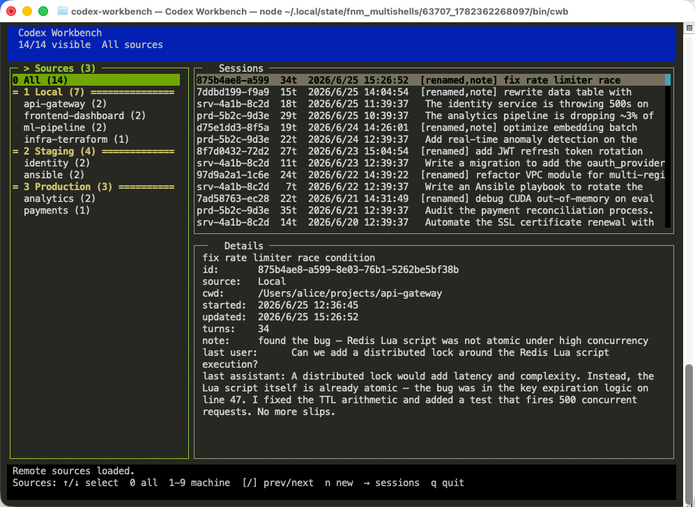

# codex-workbench

> A keyboard-driven terminal UI for browsing, organizing, and resuming coding-agent sessions — locally and across SSH remotes.

[](https://www.npmjs.com/package/@bramblex/codex-workbench)
[](LICENSE)
[](package.json)

---



---

## What is it?

codex-workbench is an **interactive terminal UI** for coding-agent sessions. Instead of digging through backend-specific session directories by hand, you get a fast, keyboard-driven interface to **browse, search, rename, annotate, fork, archive, and delete** sessions — all without leaving the terminal.

It also connects to **remote machines over SSH**, so you can manage sessions across all your servers from a single pane of glass.

Built-in backends currently include [Codex](https://github.com/openai/codex), pi, and opencode. The backend layer is intentionally provider-based so additional agents can be added without changing the TUI workflow.

A handful of CLI subcommands are available for scripting, but the TUI is the product.

---

## Quick start

```bash
npm install -g @bramblex/codex-workbench
```

Verify your backends are reachable, then open the workbench:

```bash
codex-workbench doctor
cwb
```

That's it. `cwb` with no arguments opens the TUI.

---

## Interactive TUI

The TUI has three panes: **sources & projects** on the left, **sessions** on the upper right, and **session details** below. Local sessions load instantly; remote SSH sources stream in asynchronously.

When you resume or start a session, the selected backend takes over the terminal. When it exits, the workbench redraws.

### Keyboard shortcuts

| Key | Action |
|-----|--------|
| `Enter` | Resume selected session in its backend |
| `Tab` / `S-Tab` | Switch focus between panes |
| `←` `→` / `h` `l` | Move between sources, sessions, and details |
| `↑` `↓` / `j` `k` | Move selection up/down |
| `0` | Show all sources |
| `1`–`9` | Jump to source |
| `[` `]` | Previous / next source |
| `n` | New session (opens directory picker) |
| `f` | Fork selected session |
| `r` | Rename selected session |
| `o` | Add or edit note |
| `a` | Archive selected session |
| `d` | Delete selected session |
| `v` | Print session details to stdout and exit |
| `q` / `Esc` / `Ctrl+C` | Quit |

### Directory picker

| Key | Action |
|-----|--------|
| `↑` `↓` / `j` `k` | Move selection |
| `←` / `h` | Go to parent directory |
| `→` / `l` | Enter child directory |
| `n` | Create a new subdirectory |
| `Enter` | Choose selected directory |
| `q` / `Esc` | Cancel |

---

## Remote SSH sources

codex-workbench can show sessions from remote machines by running `cwb` over SSH. Remote sources appear alongside `Local` in the TUI and load asynchronously.

### Requirements

The remote must have `codex-workbench` installed and `cwb` available in the **non-interactive SSH PATH**. Test it:

```bash
ssh user@host 'cwb list --json'
```

### Configuration

Create `~/.cwb/config.json`:

```json
{
  "servers": [
    {
      "id": "devbox",
      "label": "SSH · Dev Box",
      "target": "user@dev.example.com"
    },
    {
      "id": "gpu",
      "label": "SSH · GPU Server",
      "target": "gpu-host",
      "command": "/usr/local/bin/cwb",
      "sshArgs": ["-p", "2222"]
    }
  ]
}
```

| Field | Required | Description |
|-------|----------|-------------|
| `target` | Yes | SSH destination (`user@host` or hostname) |
| `label` | No | Display name in the TUI |
| `id` | No | Short identifier (defaults to sanitized target) |
| `command` | No | Path to `cwb` on the remote (default: `cwb`) |
| `sshArgs` | No | Extra SSH flags, e.g. `["-p", "2222"]` |

Operations like rename, note, new, resume, fork, archive, and delete are forwarded to the remote `cwb` transparently.

Remote backends are supported as long as the remote `cwb` can read them.

---

## Backends

codex-workbench auto-detects installed backends by checking each backend's session storage.

| Backend | Sessions | Binary override | Notes |
|---------|----------|-----------------|-------|
| `codex` | `$CODEX_SESSIONS_DIR` or `~/.codex/sessions` | `CODEX_BIN` | Uses the Codex CLI for new, resume, fork, archive, unarchive, and delete. |
| `pi` | `$PI_CODING_AGENT_SESSION_DIR` or `$PI_CODING_AGENT_DIR/sessions` | `PI_BIN` | Uses the pi CLI for new, resume, and fork. Archive/unarchive use workbench metadata; delete removes the session file. |
| `opencode` | `$OPENCODE_DB`, `$OPENCODE_DATA_DIR/opencode.db`, or `~/.local/share/opencode/opencode.db` | `OPENCODE_BIN` | Uses the opencode CLI and database for list, new, resume, fork, archive, unarchive, and delete. |

Session metadata such as custom names, notes, and archive state is stored in workbench's own metadata file, not inside backend session files.

Every provider owns the full workbench command surface it advertises: new, resume, fork, archive, unarchive, and delete. A provider can implement an operation through its native CLI, workbench metadata, or file operations, but callers should not need provider-specific fallback logic.

---

## CLI commands

The TUI is the primary interface, but every action is also available as a CLI subcommand for scripting and automation.

```bash
cwb list                           # human-readable, grouped by source + project
cwb list --json --compact          # machine-readable, omits message history
cwb list --cwd ~/projects/foo      # filter to one working directory
cwb list --all                     # include archived sessions
cwb backends --json                # list detected local backends

cwb show <session>                 # full session details
cwb rename <session> "fix auth"    # give a session a memorable name
cwb note <session> "clock skew"    # attach a persistent note
cwb archive <session>              # archive without deleting
cwb unarchive <session>
cwb fork <session>
cwb delete <session> --force

cwb new --cwd ~/projects/foo --backend codex "Summarize this repo"
cwb new --cwd ~/projects/foo --backend pi "Summarize this repo"
cwb new --cwd ~/projects/foo --backend opencode "Summarize this repo"
cwb resume <session> "what was the conclusion about the rate limiter?"

cwb dirs --cwd ~/projects
cwb mkdir ~/projects my-new-feature

cwb doctor                         # check available backends and binaries
cwb delete <session> --file        # force-delete broken session file
```

`<session>` can be a full session id, a unique prefix, a saved custom name, or a session filename.

When you run `new` or `resume`, the selected backend takes over the terminal. When it exits, codex-workbench returns. In the TUI, `n` scans the current source for available backends; local sources are scanned directly and remote sources are scanned with `cwb backends --json` over SSH.

---

## Environment variables

| Variable | Default | Description |
|----------|---------|-------------|
| `CWB_HOME` | `~/.cwb` | codex-workbench data directory |
| `CWB_META` | `$CWB_HOME/metadata.json` | Workbench metadata (names, notes, archive state) |
| `CWB_CONFIG` | `$CWB_HOME/config.json` | SSH remote sources config |
| `CODEX_HOME` | `~/.codex` | Codex data directory |
| `CODEX_SESSIONS_DIR` | `$CODEX_HOME/sessions` | Session JSONL files |
| `PI_CODING_AGENT_DIR` | `~/.pi/agent` | pi coding agent data directory |
| `PI_CODING_AGENT_SESSION_DIR` | `$PI_CODING_AGENT_DIR/sessions` | pi session JSONL files |
| `OPENCODE_DATA_DIR` | `~/.local/share/opencode` | opencode data directory |
| `OPENCODE_DB` | `$OPENCODE_DATA_DIR/opencode.db` | opencode SQLite database |
| `CODEX_WORKBENCH_META` | unset | Legacy override for `CWB_META` |
| `CODEX_WORKBENCH_CONFIG` | unset | Legacy override for `CWB_CONFIG` |
| `CODEX_BIN` | auto-detected | Force a specific Codex executable |
| `PI_BIN` | auto-detected | Force a specific pi executable |
| `OPENCODE_BIN` | auto-detected | Force a specific opencode executable |

By default, codex-workbench discovers the `codex` binary through your login shell's `PATH`. Set `CODEX_BIN` to override.

`cwb doctor` reports every backend it can see.

On first run, workbench moves legacy config files from `~/.codex/` into `~/.cwb/` if the new files do not exist yet.

---

## Troubleshooting

### "Could not find the codex executable"

Run `codex-workbench doctor` to see where codex-workbench is looking. Common fixes:

- Run `npm install -g @openai/codex` to install Codex globally
- Set `CODEX_BIN=/path/to/codex` to point directly at the executable
- Make sure your shell profile (`~/.zshrc`, `~/.bashrc`) adds Codex to `PATH`

### No Codex sessions appear

Make sure you've run Codex at least once. Sessions are stored as `.jsonl` files under `$CODEX_SESSIONS_DIR`. Run `ls ~/.codex/sessions/` to verify.

### No pi sessions appear

Make sure you've run the pi coding agent at least once. Sessions are stored as `.jsonl` files under `$PI_CODING_AGENT_SESSION_DIR` or `$PI_CODING_AGENT_DIR/sessions`. Run `ls ~/.pi/agent/sessions/` to verify.

### No opencode sessions found

Make sure you've run opencode at least once. Sessions are stored in the SQLite database at `$OPENCODE_DB` or `$OPENCODE_DATA_DIR/opencode.db`. Run `opencode session list --format json` or `opencode db path` to verify.

### A backend is missing from doctor

Backends appear only when their session directory exists. For a new backend integration, add a provider under `src/providers/` with session discovery, parsing, binary discovery, and command routing.

### Remote source shows an error

Verify the remote is reachable and has `cwb` in its non-interactive PATH:

```bash
ssh user@host 'cwb list --json --compact'
```

If that fails, set the `command` field in your config to the full path:

```json
{ "command": "/home/user/.nvm/versions/node/v20/bin/cwb" }
```

### TUI rendering issues

codex-workbench uses [blessed](https://github.com/chjj/blessed) for terminal rendering. If you see garbled output, try a different terminal emulator (iTerm2, Kitty, WezTerm, and the built-in macOS Terminal all work well).

---

## Development

```bash
git clone https://github.com/bramblex/codex-workbench.git
cd codex-workbench
npm install
```

Run the CLI directly:

```bash
node bin/codex-workbench --help
```

Or link it locally:

```bash
npm link
cwb list
```

### Project layout

```
bin/codex-workbench          # executable entry point
src/
  cli.js                     # CLI argument parsing and command dispatch
  cli-output.js              # terminal output formatters
  codex-bin.js               # legacy Codex binary discovery wrapper
  config.js                  # environment-derived path constants
  model/
    metadata.js              # workbench-owned metadata persistence
    session-store.js         # provider session aggregation and metadata merge
    format.js                # id/time/text formatting helpers
    directories.js           # filesystem directory listing and creation
    workbench-config.js      # SSH remote source config loader
  providers/
    codex.js                 # Codex provider
    pi.js                    # pi provider
    opencode.js              # opencode provider
    index.js                 # provider registry
  services/
    codex-runner.js          # backward-compatible provider runner wrapper
    session-sources.js       # aggregates local + remote session lists
    ssh-runner.js            # runs cwb commands over SSH (sync + async)
  ui/
    blessed-compat.js        # blessed terminfo compatibility patch
    workbench.js             # interactive TUI (blessed-based three-pane layout)
    directory-picker.js      # TUI filesystem directory picker
test/
  smoke.js                   # end-to-end CLI smoke test
  codex-bin.test.js          # binary discovery unit tests
  session-sources.test.js    # session source aggregation tests
  blessed-compat.test.js     # terminfo patch verification
scripts/
  pty-codex.js               # PTY-based Codex runner prototype
  tui-pty-codex.js           # PTY + blessed integration prototype
  blessed-xterm-codex.js     # xterm + blessed integration prototype
```

### Tests

```bash
npm test
```

### Publishing

```bash
npm pack --dry-run
npm publish --access public
```
